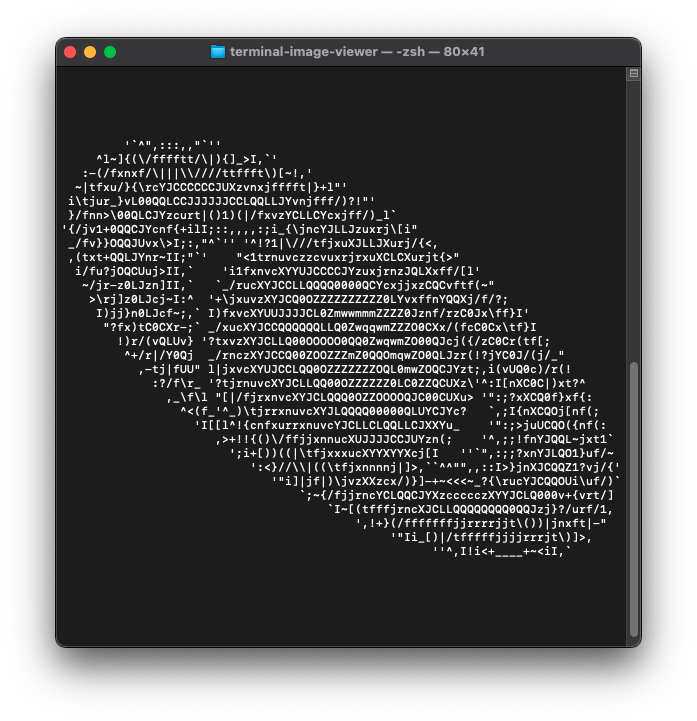

# terminal-image-viewer
A simple project to display images in terminal.

## Features
- Display an image in terminal

## Screenshots
| Original                      | In terminal                      |
| ----------------------------- | -------------------------------- |
|  |  |
|    |    |
|    |    |

## Usage
### Install dependencies
```
python3 -m venv .venv
source .venv/bin/activate
pip install -r requirements.txt
```

### Display image
```
python3 main.py example/lenna.bmp
```